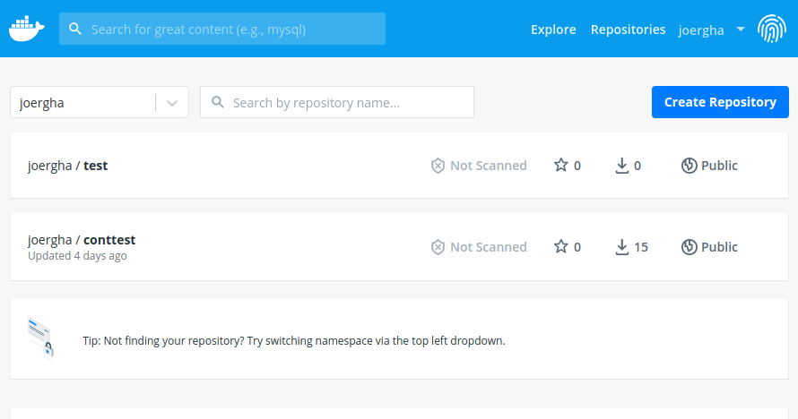
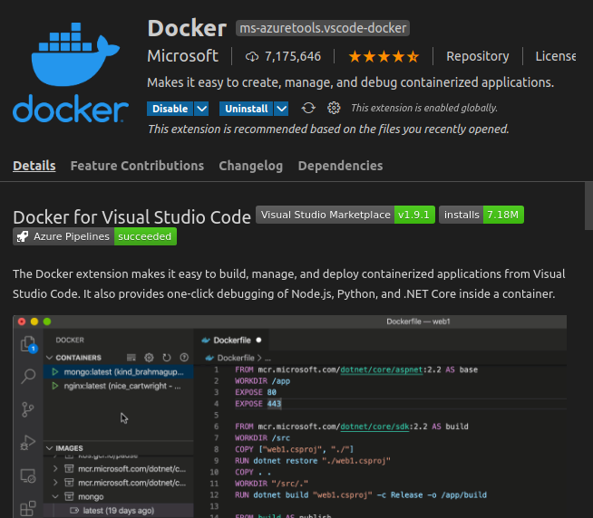

# Docker
## What is docker

Docker is a platform for providing containerized applications. It consists of a deamon (service) and a cli communicating via Rest-interface. Docker is hosted on GitHub. The URL is https://github.com/docker.

The docker service communicates with a number of repositories. There is the local repository hosted on the machine of the docker service and ond or many other arbitrary repositories containig containers the appropirate service pulls. To mention is especially the public docker repository conataing many software packes ranging from os's up to development environments. The official repository docker hub is https://hub.docker.com/.

Beside the public repository each user can also push images inside the docker reposiotory. Therefore you must create an docker account. Then you getyour own repository where you can host privat and public images. The following screenshot shows the personal repository in the docker hub:




What means a containerized application? a container is an instance of an image and runs on a isolated environment on a machine managed by the deamon. Isolation means that initially the application can not communicatied withe the outside environment at all. By providing communication facilities like networks or volumes it t possible to interact with the container.


### Container

The container is the central building block of docker-application. A container is an instance of an image. The image can be created from an underlying image and a set of instructions. By issuing the docker create command the image is intanciated. This occures by the command 

```
docker create [OPTIONS] IMAGE [COMMAND] [ARG...]
```

By specifing options you can govern what ressources environament-variables, hostnames, ip-adresses etc. are applied for the specific instance. A complete list can be found by issuing docker create help. 


## Installation
### Setup the docker repository

Description for Ubuntu is available on https://docs.docker.com/engine/install/ubuntu/. This installs docker on an ubuntu platform residing on an arm64 computer (means a Rapberry PI 4). First install the prerequisits, 

```
$ sudo apt-get update

$ sudo apt-get install \
    apt-transport-https \
    ca-certificates \
    curl \
    gnupg-agent \
    software-properties-common
```

then download the official GPG-key 

```
$ curl -fsSL https://download.docker.com/linux/ubuntu/gpg | sudo apt-key add -
```

and the binaries for arm64

```
$ sudo add-apt-repository \
   "deb [arch=arm64] https://download.docker.com/linux/ubuntu \
   $(lsb_release -cs) \
   stable"
```


### Setup the engine

The following command installs the docker deamon (docker ce), the common language interface and the appropriate documentation

```
 $ sudo apt-get update
 $ sudo apt-get install docker-ce docker-ce-cli containerd.io
```

Verify that Docker Engine is installed correctly by running the hello-world image.

```
$ sudo docker run hello-world
```

This commands pulls the hello-world image from the official docker hub, installs it in the local repository and spins off the container. By the installation the  directory /var/lib/docker/ is created. There all the configuration of the local deamon lives. The directory is protected so only the deamon (and the administrator) can use ist. It contains relevant information about images, volumes and so on. 


### Remarks

For administering docker there is docker dashboard. This is only availabale for Mac and Windows. For other distributions the management of docker occures via the cli (docker.exe) or the integration in VS-Code.

## VS-Code integration
### Manage Docker
VS-code allows to start and stop a container, to remove an image, to inspect an image and run a command inside the container and many other things. A good description is conatained in the Video

https://www.youtube.com/watch?v=sUZxIWDUicA&feature=emb_rel_end

Almost all aspects of runnind docker can be managed by visial studio and the docker add-in.




### Debuging a Python app 

This is refereced to 14:16 in the Video "Become a Docker Power User with Microsoft ....". Just write and debug the python app. Then the application is ready issue the command: 

    STRG+SHIFT+P docker add docker compose files to Workspace...

select the approriate type of application (genaral, Flask ....) and VSCode adds the required files for dockerisation into the workspace. After a couple of questions VSCode adds the docker-compose.yml, docker-compose-debug.yml a Dockerfile and the reuqirements.txt file. Furthermore this command adds a additional debug configuration in the launch.json file (and creates a tasks.json file). By selecting this debug configuration you can debug the application inside the docker container.

## Build a container
### Methods

There are a cpople of methods for builduing docker images. Each methode is focusing on different aspects of the creation of a docker application.

+ docker build focuses on the creation of a single image
+ Docker-compose focuses on multiple images commulating in the creation of a service
+ build on docker hub. It focuses on an automated build process inegrated with github (CI/CD Continious integration / Continiuos Build) 
+ docker buildx: Build docker images via BuildKit. 


### Docker build

A container is build by issuing the docker build command. This command looks for the Dockerfile for the building instructions of the image. The follwing file shows a sample Dockerfile:

```
# For more information, please refer to https://aka.ms/vscode-docker-python
FROM   python:3.8-slim-buster

# Keeps Python from generating .pyc files in the container
ENV PYTHONDONTWRITEBYTECODE=1

# Turns off buffering for easier container logging
ENV PYTHONUNBUFFERED=1

# Install pip requirements
COPY requirements.txt .
RUN python -m pip install -r requirements.txt

WORKDIR /app
COPY . /app

# Switching to a non-root user, please refer to https://aka.ms/vscode-docker-python-user-rights
RUN useradd appuser && chown -R appuser /app
USER appuser

# During debugging, this entry point will be overridden. For more information, please refer to https://aka.ms/vscode-docker-python-debug
CMD ["python", "webserver.py"]

```
The syntax of the Dockerfile is described in 
https://docs.docker.com/engine/reference/builder/. The description of the build command is describedd in https://docs.docker.com/engine/reference/commandline/build/.

A very good description how to build and run a container can maitaining docker can be found in:

    https://youtu.be/iqqDU2crIEQ


## Docker compose reference 

the docker compose reference can be found here:

https://github.com/compose-spec/compose-spec/blob/master/spec.md#volumes-top-level-element


## docker hub
## automated builds

you can connect the docker build and a github repository. Then you can setup an automated build process which becomes trggert on a specific event. E.g. you can trigger a new build each time a newgithub commit occures. Docker fetches the sources and the assiciated dockerfuile and builds a new image. The image gets stored in the personal reposititory and pulled by the docker deamon of each maschine. 


## building multi platform Containers 

https://github.com/ckulka/docker-multi-arch-example

https://medium.com/@artur.klauser/building-multi-architecture-docker-images-with-buildx-27d80f7e2408